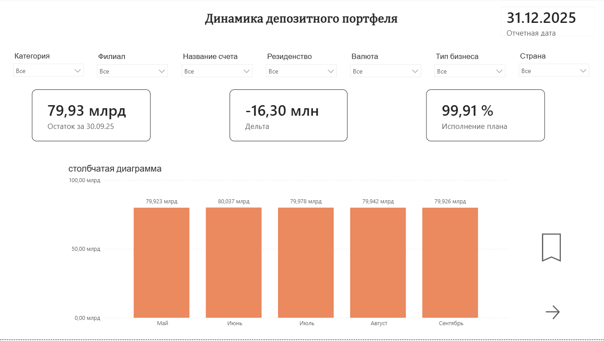
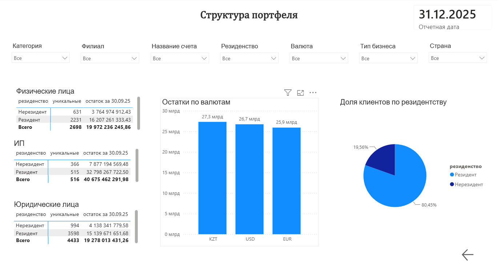

# deposit-portfolio-dashboard

Дашборд в Power BI для мониторинга депозитного портфеля банка: план-факт анализ остатков, 
сегментация клиентской базы и структура портфеля по нескольким срезам.

## Инструменты
- **Power BI** — модель данных, визуализация
- **DAX** — расчётные меры для план-факт отчётности по остаткам

## Что показывает дашборд

**Страница "Динамика депозитного портфеля":**
- Карточки с ключевыми показателями портфеля
- Динамика остатков во времени (линейный график)
- Структура по сегментам (столбчатая и круговая диаграммы)
- Фильтры по периоду, продукту, сегменту клиента

**Страница "Структура портфеля":**
- Разбивка портфеля по типам клиентов: физические лица, ИП, юридические лица (сводные таблицы)
- Остатки по валютам
- Доля клиентов по резидентству

## Скриншоты

## Структура репозитория
- `deposit_portfolio.pbix` — файл дашборда Power BI
- `screenshots/` — скриншоты дашборда
